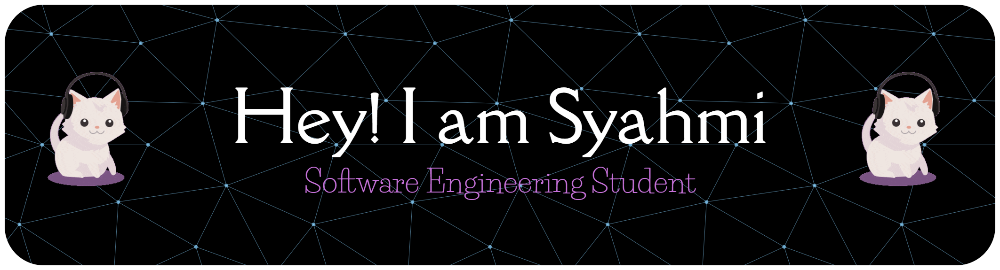

# Introduction
Hi! I'm Muhammad Irham Syahmi bin Arawi, a student in the Software Maintenance and Evolution course. 
I [expect to learn a lot about modern software maintenance practices and how to work with legacy systems].

  <!-- Link to the uploaded image -->

## GitHub Profile

You can view my personalized GitHub profile [here, insert link to your github profile]

